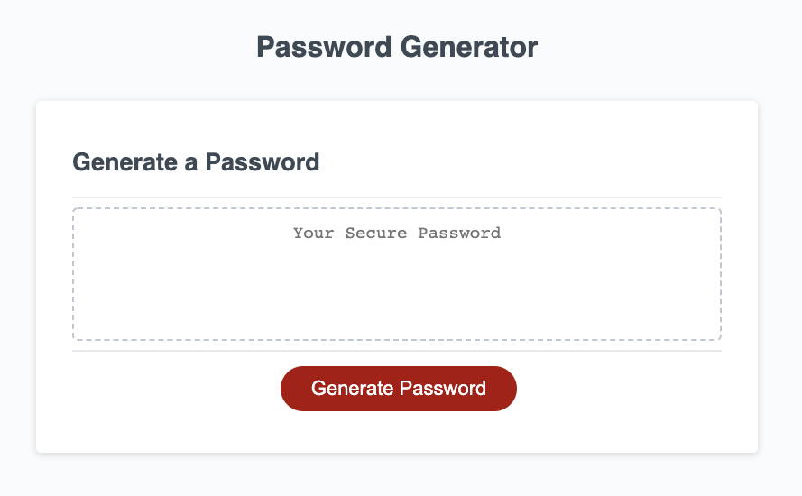
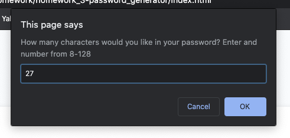
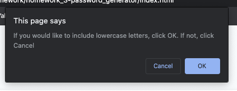
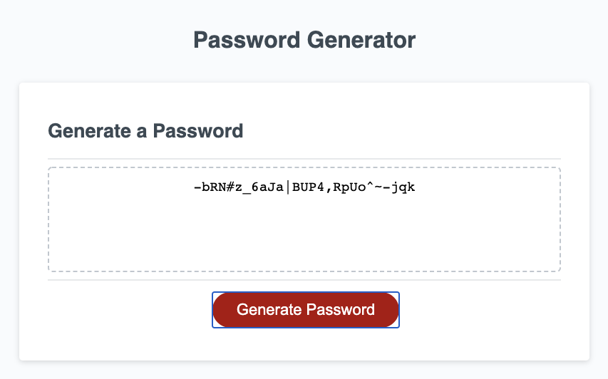

# Random Password Generator

This random password generator created a password from 4 potential character types at a desired length from 8 to 128 characters.

[Password Generator](https://raleighc.github.io/homework_3-password_generator/)

## Usage
This password generator uses a javascript for loop to randomize the chosen characters into a new password.

The user will begin by clicking the "Generate Password" button. They will then be prompted to select the length they would like for their new password.

Following a valid entry on this selection, they will then be prompted on 4 different character types to include in their password. The choices include uppercase letters, lowercase letters, numbers, and special characters.

After making their final selections the user will be generated with a randomized password containing their chosen characters.

## Creating This Page

For this project, I was given the original HTML and CSS files that have been left as is. My task was to create the Javascript file to make this page operate correctly given the specific set of criteria.
This has by far been the most challenging project I have faced. I ran into the most issues in correctly executing the for loop at the end of my function. Understanding what all information needs to be plugged in and the order that it required to correctly generate a random password took a lot of trial and error. I originally began by arranging my variables as arrays, but latter had to change them all into strings because the commas used to separate the index items of my array were making their way into the generated password. I plan on revisiting this project in the future to work out how to make the array method run successfully.

## Contributions

When contributing to this repository, please contact the owner of the repository before pushing any updates.
When contributions are accepted, please update the readme.md noting any changes that have been made.

## Authors and Acknowledgment

The HTML and CSS files for this project were created and supplied by Georgia Tech Coding Boot Camp.

Thank you to all of my GT Bootcamp classmates who have offered advice and helped fix bugs alone the way.

## License

MIT License

Copyright (c) 2020 Raleigh Chesney

Permission is hereby granted, free of charge, to any person obtaining a copy
of this software and associated documentation files (the "Software"), to deal
in the Software without restriction, including without limitation the rights
to use, copy, modify, merge, publish, distribute, sublicense, and/or sell
copies of the Software, and to permit persons to whom the Software is
furnished to do so, subject to the following conditions:

The above copyright notice and this permission notice shall be included in all
copies or substantial portions of the Software.

THE SOFTWARE IS PROVIDED "AS IS", WITHOUT WARRANTY OF ANY KIND, EXPRESS OR
IMPLIED, INCLUDING BUT NOT LIMITED TO THE WARRANTIES OF MERCHANTABILITY,
FITNESS FOR A PARTICULAR PURPOSE AND NONINFRINGEMENT. IN NO EVENT SHALL THE
AUTHORS OR COPYRIGHT HOLDERS BE LIABLE FOR ANY CLAIM, DAMAGES OR OTHER
LIABILITY, WHETHER IN AN ACTION OF CONTRACT, TORT OR OTHERWISE, ARISING FROM,
OUT OF OR IN CONNECTION WITH THE SOFTWARE OR THE USE OR OTHER DEALINGS IN THE
SOFTWARE.
